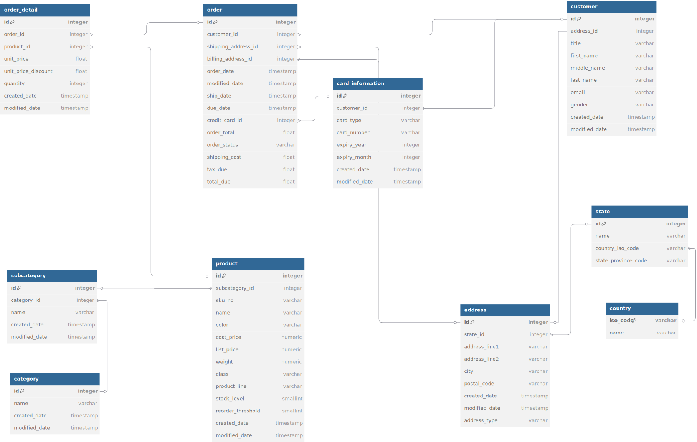
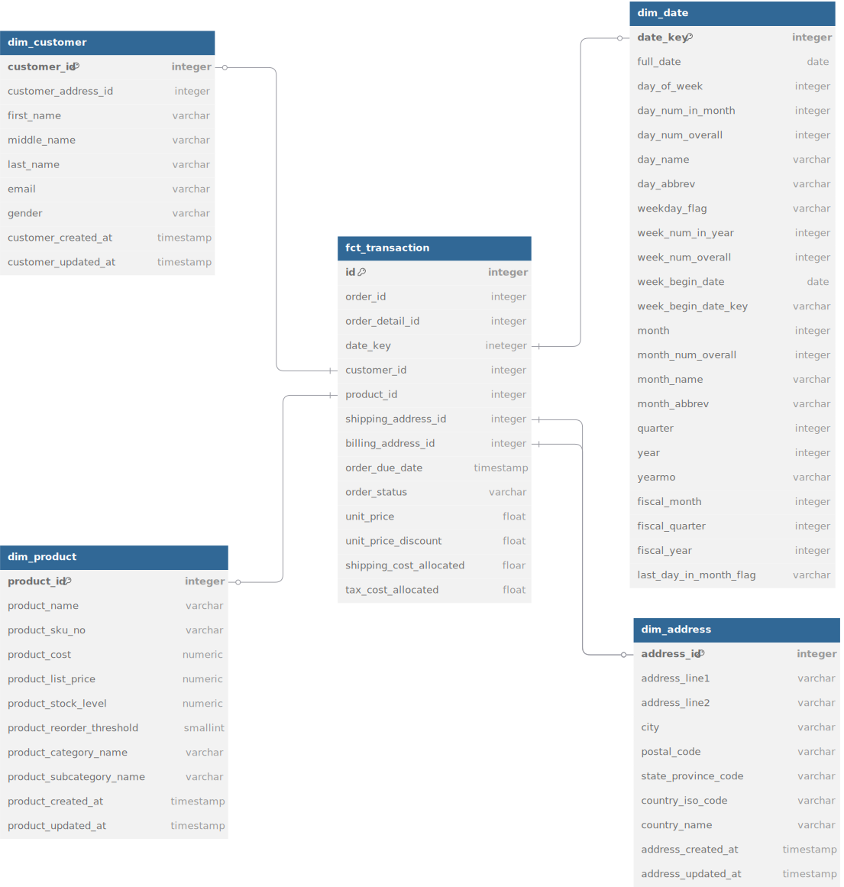
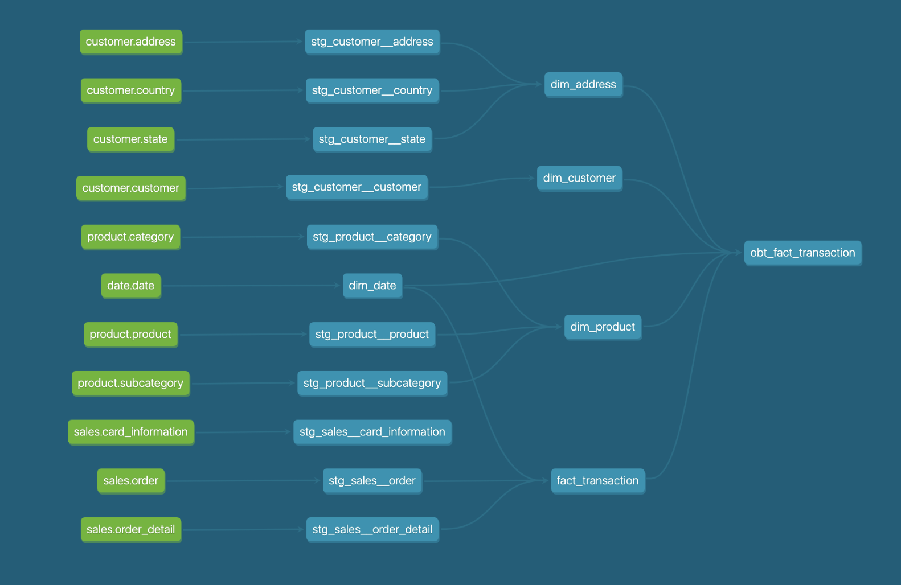

Here is a **simplified version** of the document, focusing on clarity and practical steps, while referencing relevant diagrams for ease of navigation.

---

# Dimensional Modelling with dbt for Retail Analytics

---

## 🛠️ Project Overview

This project builds a dimensional model using **dbt** and **DuckDB** for a retail analytics use case. We focus on modelling the **sales process** by transforming raw e-commerce data into a star schema to support year-over-year revenue analysis.

---

## 1️⃣ Dimensional Modelling Principles

We apply Ralph Kimball’s dimensional modelling approach to simplify data access for analytics:

* **Fact tables** capture measurable business events (e.g. product sales).
* **Dimension tables** describe context (e.g. product details, customer info).
* **Star schema** is used for ease of querying and performance.

📌 Refer to **Star Schema ERD** for visual structure.

---

## 2️⃣ dbt: Key Concepts

**dbt (Data Build Tool)** transforms raw data into clean, tested, and documented models.

* SQL-based models, tested and version-controlled.
* Supports modular structure and data lineage.
* Generates automatic docs and DAGs.

📌 See **dbt Lineage Diagram** for transformation flow.

---

## 3️⃣ Implementation Steps

### 🧰 Setup & Environment

Install tools:

```bash
pip install dbt-core dbt-duckdb
pip install pre-commit sqlfluff sqlfluff-templater-dbt  # Optional: linting
```

Use recommended versions for compatibility.

---

### 🧩 Step 1: Define Business Process and Grain

### Application Layer ERD for the Raw Data


**Business process**: Sales
**Grain**: Each order line item (most detailed level)

Supports flexible aggregation (e.g. by product, location, date).

---

### 🏗️ Step 2: Design Star Schema

**Fact Table**

* `fct_transaction`: Measures like unit price, quantity, revenue, etc.

**Dimension Tables**

* `dim_address`
* `dim_customer`
* `dim_date` (generated)
* `dim_product`

---

### 🧱 Step 3: Build dbt Models

#### 🔹 3.1: Define Sources

Declare raw tables in `sources/` .yml files.

```yaml
sources:
  - name: customer
    schema: customer
    tables:
      - name: customer
```

#### 🔹 3.2: Create Staging Models

Standardise raw tables with consistent column names and types.

```sql
select
    id as customer_id,
    first_name,
    last_name,
    ....,
from {{ source('customer', 'customer') }}
```

#### 🔹 3.3: Build Dimensions

Join and transform staging models into denormalised dimensions.

```sql
select
  product_id,
  product_name,
  ....
from {{ ref('stg_product__product') }}
```

#### 🔹 3.4: Build Fact Table

Join staging models and dimension keys to form fact rows at defined grain.

```sql
select
  o.order_id,
  p.product_id,
  c.customer_id,
  od.unit_price,
  quantity
  ....
from {{ ref('stg_sales__order') }} as o
inner join {{ ref('stg_sales__order_detail') }} as od
    on o.order_id = od.order_id
inner join line_item_total as lit
    on od.order_detail_id = lit.order_detail_id
inner join {{ ref('dim_date') }} as d
    on o.order_created_at = d.full_date
...
```

#### 🔹 3.5: Materialisation Strategy

Configure materialisation in `dbt_project.yml`:

```yaml
models:
  your_project:
    marts:
      +materialized: table
```

* Dimensions: `table`
* Facts: `incremental` (optional for large data)

### Star Schema ERD


#### 🔹 3.6: Add Documentation & Tests

Define tests in `.yml` files:

```yaml
models:
  - name: dim_product
    description: "Product Dimension Table"
    columns:
      - name: product_id
        description: integer
        tests:
          - unique
          - not_null
```
Add Dependencies to the packages.yml file:

```yaml
packages:
  - package: calogica/dbt_date
    version: [">=0.9.0", "<0.10.0"]
  - package: dbt-labs/dbt_utils
    version: [">=1.3.0"]
```

Install dependencies:
```bash
dbt deps
```

Run the seed, model and tests:
```bash
dbt build
```

Generate docs and access on localhost:8080:

```bash
dbt docs generate
dbt docs serve
```


### dbt Lineage Diagram **dbt Lineage Diagram** for model flow and relationships.



## NOTE: The final view is a One Big Table approach to simplify/speed up quering.
---

## ✅ Summary

| Step          | Output                                    |
| ------------- | ----------------------------------------- |
| Define grain  | Order line item                           |
| Fact Table    | `fct_sales`                               |
| Dimensions    | `dim_customer`, `dim_product`, etc.       |
| Schema Type   | Star Schema                               |
| dbt Layers    | Sources → Staging → Dimensions/Facts → OBT|
| Diagram Links | ERD + Lineage                             |

---
